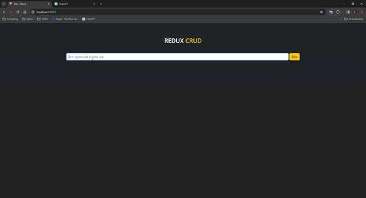

# Redux Todo App

I created a todo app with react-redux. I used json-server to send API requests and save todos. I used bootstrap for the design.
I implemented the dynamics so that we can add, edit and then delete todos.

# Screen

# Libraries
- React-redux / Redux / Bootstrap / Axios / Json-server / uuid
